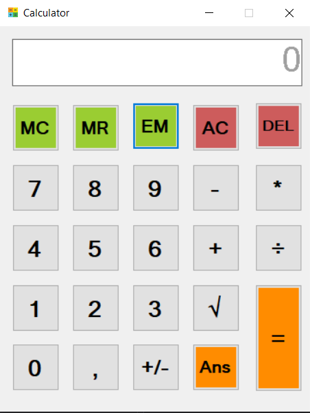

# Tubes1-OOP
Created by Florencia Wijaya, Yahya, Syarifuddin, Rafael Sean

## Requirement
- .NET Framework versi terbaru
- Visual Studio (Untuk Compile & Run)

## Structure Code
Calculator-TubesOOP  
    ├───bin
    │   ├───Debug
    │   └───Release
    ├───obj
    │   ├───Debug
    │   │   └───TempPE
    │   └───Release
    │       └───TempPE
    ├───Properties
    └───Resources

## Cara Compile
- Buka folder tempat file disimpan
- Jalankan Calculator.csproj di Visual Studio
- Pilih "Start" pada toolbar di bagian atas Visual Studio, pastikan target berupa "Debug"

## Cara Run
- Buka folder tempat file disimpan
- Buka folder obj
- Buka folder Release
- Jalankan "Calculator.exe"

## Aplikasi

